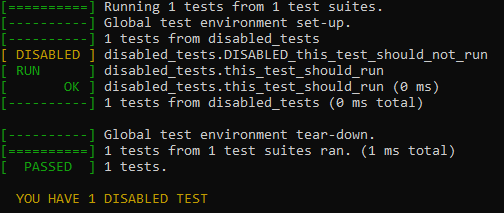

# RK Test

RK Test is a small [STB-style](https://github.com/nothings/stb/tree/master) single
header unit testing library for C99, written to closely mimick
[Google Test](https://github.com/google/googletest). RK Test is lightweight and
easy to integrate into a C project to add testing capabilities.

## Features
RK Test has the following features:
- Small and easy to integrate
- Supports Windows, MacOS and Linux.
- Self registering tests (relying on a compiler extension common to MSVC, AppleClang and GCC)
- xUnit style assertions and test reporting very close to Google Test
- Filter tests using `--rktest_filter=PATTERN` where the pattern uses [glob syntax](https://en.wikipedia.org/wiki/Glob_(programming))
- Disable tests with by prefixing test names with `DISABLED_`

Roadmap:
- Parameterized tests
- Death tests (tests that can verify `assert()`, `abort()`, and other program exits)

For a motivation for why to consider RK Test in favor of Google Test, see [Why use RK Test](https://github.com/Warwolt/rktest/blob/main/README.md#why-use-rk-test-instead-of-google-test).

## Usage
Due to the similarities between RK Test and Google Test, it may be helpful to read the [Google Test primer](https://google.github.io/googletest/primer.html.).

For instruction on building, see [Integrating](#integrating).

Test cases are defined with the `TEST()` macro, which takes two arguments: the
name of the test suite, and the name of the test case. A body is then given,
which will be executed like a function. The `EXPECT_EQ` takes two integral types
and compares them, and fails the test in case they are not equal.

```C
#include <rktest/rktest.h>

int factorial(int n) {
	int result = 1;
	for (int i = 1; i <= n; i++) {
		result *= i;
	}

	return result;
}

TEST(simple_tests, factorial_of_negative_is_one) {
	EXPECT_EQ(factorial(-1), 1);
	EXPECT_EQ(factorial(-42), 1);
}

TEST(simple_tests, factorial_of_zero_is_one) {
	EXPECT_EQ(factorial(0), 1);
}

TEST(simple_tests, factorial_of_positive_numbers) {
	EXPECT_EQ(factorial(3), 6);
	EXPECT_EQ(factorial(4), 24);
}
```

Building and running the above gives the following output:


We can modify the `factorial` function to be faulty to observe the error messages printed when the tests fail.

```diff
int factorial(int n) {
	int result = 1;
-	for (int i = 1; i <= n; i++) {
+	for (int i = 1; i < n; i++) {
		result *= i;
	}

	return result;
}
```

Rerunning the test suite now gives:


## Integrating
RK Test consists of a single header file `rktest.h`. The easiest way to
integrate RK Test is to just copy that header file into your source tree.
Alternatively, RK Test can be built as a CMake project.

### STB Style

To integrate RK Test as a single header library, copy `rktest.h` into your
source tree, and then in EXACTLY ONE source file define
`DEFINE_RKTEST_IMPLEMENTATION` before including the header.

Additionally, this source file can define the main function:

```C
// rktest.c
#define DEFINE_RKTEST_IMPLEMENTATION
#include <rktest/rktest.h>

int main(int argc, const char* argv[]) {
    return rktest_main(argc, argv);
}
```

### CMake
In case your project is using CMake, you can easily integrate RK Test by adding
this repository into your source tree and then including the RK Test
`CMakeLists.txt` from your own.

There's an example repository available here:
https://github.com/Warwolt/rktest_example

In short, to integrate RK Test into your CMake project, first add this
repository into your file structure either by copying it or by using `git add
submodule` to add a git submodule.

Then, update your `CMakeLists.txt` with a `add_subdirectory` and add a test
runner executable that links against `rktest`. Example:

```cmake
add_subdirectory(external/rktest)

add_executable(tests
    src/hello_world.c
    tests/hello_world_tests.c
)
target_include_directories(tests PRIVATE src)
target_link_libraries(tests PRIVATE rktest)
```

## Assertions
All assertion macros come in `EXPECT_*` and `ASSERT_*` variants, where `EXPECT_*`
continues to execute the remaining test on failure, whereas `ASSERT_*` aborts
the current test case on failure.

Additionally, all macros has `*_INFO` variants, which allows passing a
printf-style formatting string that will be printed if the assertion fails to
give additional user specified details.

RK Test defines the following assertion macros for bools:

| Macro name           | Assertion               |
| -------------------- | ----------------------- |
| EXPECT_TRUE(actual)  | `actual` equals `true`  |
| EXPECT_FALSE(actual) | `actual` equals `false` |

Integer assertions:

| Macro name                  | Assertion              |
| --------------------------- | ---------------------- |
| EXPECT_EQ(actual, expected) | `actual` == `expected` |
| EXPECT_NE(actual, expected) | `actual` != `expected` |
| EXPECT_LT(actual, expected) | `actual` < `expected`  |
| EXPECT_LE(actual, expected) | `actual `<= `expected` |
| EXPECT_GT(actual, expected) | `actual `> `expected`  |
| EXPECT_GE(actual, expected) | `actual `>= `expected` |

Long integer assertions:

| Macro name                       | Assertion              |
| -------------------------------- | ---------------------- |
| EXPECT_LONG_EQ(actual, expected) | `actual` == `expected` |
| EXPECT_LONG_NE(actual, expected) | `actual` != `expected` |
| EXPECT_LONG_LT(actual, expected) | `actual` < `expected`  |
| EXPECT_LONG_LE(actual, expected) | `actual `<= `expected` |
| EXPECT_LONG_GT(actual, expected) | `actual `> `expected`  |
| EXPECT_LONG_GE(actual, expected) | `actual `>= `expected` |

String assertions:

| Macro name                          | Assertion                                                     |
| ----------------------------------- | ------------------------------------------------------------- |
| EXPECT_STREQ(actual, expected)      | `actual` is the same string as `expected`                     |
| EXPECT_STRNE(actual, expected)      | `actual` is NOT the same string as `expected`                 |
| EXPECT_CASE_STREQ(actual, expected) | `actual` is the same string as `expected` (ignoring case)     |
| EXPECT_CASE_STRNE(actual, expected) | `actual` is NOT the same string as `expected` (ignoring case) |

Floating point assertions (See [this article](https://randomascii.wordpress.com/2012/02/25/comparing-floating-point-numbers-2012-edition/)
regarding Units in Last Place):

| Macro name                         | Assertion                                              |
| ---------------------------------- | ------------------------------------------------------ |
| EXPECT_FLOAT_EQ(actual, expected)  | `actual` and `expected` are within 4 ULP of each other |
| EXPECT_DOUBLE_EQ(actual, expected) | `actual` and `expected` are within 4 ULP of each other |

## Filtering tests

It's possible to run only some specific tests, which is useful when trying to
debug why a given test or set of tests are failing.

By passing the argument `--rktest_filter=PATTERN`, where `PATTERN` uses
[glob syntax](https://en.wikipedia.org/wiki/Glob_(programming)), only tests that
matches the pattern will be executed.

Glob syntax matches `*` to any number of characters, and `?` to a single
character. The matching will be done to the full test name, e.g.
`factorial_tests.factorial_of_negative_is_one`.

Example, if you run `./tests --rktest_filter="float_tests*"` then all tests whos
full name starts with `float_tests` will be ran:


## Disabling tests

Instead of commenting out tests that for some reason are desired to exclude from
the test execution, it's possible to disable them, which will still compile
them.

To disable a test, just prefix the test name with `DISABLED_`. Such a test will
show up during test execution with a `[ DISABLED ]` prefix, and reminder text
will be printed to inform that tests were disabled during test execution.

For example, the following test is disabled:

```c
TEST(disabled_tests, DISABLED_this_test_should_not_run) {
	EXPECT_EQ(1 + 1, 3);
}
```

Running this test gives:



## Setup and Teardown

When testing using resources with state that persists between tests, like
accessing files on disk, it may be helpful to be able to setup/teardown those
resources before tests run.

The `TEST_SETUP(suite_name)` and `TEST_TEARDOWN(suite_name)` macros can assist
in these situations.

If we have a test file `foo_tests.c` that defines a test suite `foo_tests`, we
can add setup and teardown functions to this test suite:

```C
// foo_tests.c
TEST_SETUP(foo_test) {
	// do some setup
}

TEST_TEARDOWN(foo_tests) {
	// do some teardown
}

TEST(foo_tests, some_test) {
	// run test
}
```

The `TEST_SETUP()` and `TEST_TEARDOWN()` functions will run before _each_ test in the test suite, if they are defined.

## Why use RK Test instead of Google Test?

While Google Test is a much more mature test library, it's written in C++. This means
that when testing C code, it requires calling that C code from C++ code, which can be
awkward due to requiring `extern C` or lacking C99-style designated initializers.

Additionally, the Google Test source is many thousands of lines long, which
makes it a non-trivial dependency to add to a project.

Comparatively, RK Test is lightweight at just around 1k lines of code in just
one `*.c` file and one `*.h` and is written in C, so both code under test and
the test cases are written in the same language. This allows RK Test to easily
be integrated into other C projects, while keeping largely the same development
experience as Google Test.

If you want a Google Test written in C, and can live with some missing features
and appreciate a small footprint, consider using RK Test.

## See also

Here's a list of other unit test frameworks built on similar techniques:

- [Google Test](https://github.com/google/googletest)
- [Criterion](https://github.com/Snaipe/Criterion/)
- [Rexo](https://github.com/christophercrouzet/rexo/)

## For maintainers

The following is useful for maintainers of RK Test.

### Building the test and sample files

The files in the `tests` and `samples` are by default not built, but can be enabled by passing the following when generating the CMake build:

```
cmake -B build -D rktest_build_tests=ON -D rktest_build_samples=ON
```

### Running the snapshot tests of RK Test

RK Test uses python and snapshot tests to test the output from the library. To run the snapshot tests, first install python:

- https://www.python.org/downloads/

Then, install pytest:

```
pip install pytest syrupy
```

Finally, run the tests from repo root:

```
pytest -vv
```

If a snapshot needs to be updated, run:

```
pytest --snapshot-update
```

And commit the updated snapshots.
